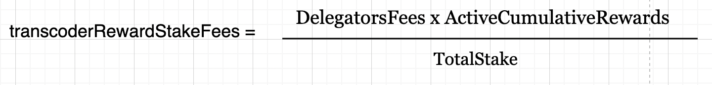

# Joe

### Intro

The BondingManager has a vulnerability that allows the cumulative fees in the earnings pool to be increased while the totalstakes don't. Cumulative fees represent the total amount of collected fees, and this exploit can be used to drain all ETH from the Minter.




Generally in protocols when 1e18 is staked, and the fee is set to 10%. The Cumulative rewards are 1e16 with a totalstake of 1e18. The Cumulative fees could/should never be bigger than than the totalstakes.

With this exploit you can increase Cumulative fees while keeping totalstake 1, this causes the rewards for transcodersRewards to skyrocket beyond the expected value, draining the funds allocated for fee distribution.


### Livepeer

Users can bond to a transcoder by staking tokens to earn yield over time. There are multiple transcoders to choose from, each created and managed by users.

A transcoder in the Livepeer network has two main fee structures:

1. Reward Cut Rate: This is the percentage of rewards paid by delegators that the transcoder keeps.
2. Delegator Fee Cut: This is the percentage of transcoding fees that the transcoder distributes to delegators.

#### Protocol Limits

The protocol limits the number of active transcoders. In this case, the maximum is 50 transcoders.

#### Becoming an Active Transcoder

To become an active transcoder, you must bond or stake more ETH than the current least staked active transcoder. By doing so, you replace them and take their spot in the top 50.

For example, if the least staked transcoder has 40 ETH, you must stake more than 40 ETH to become active and "kick them out" of the active pool.
Where does it go wrong?

When a transcoder is removed from the active transcoder pool:
* Their deactivation round is set, and they are immediately removed from the pool.
* However, their stake in the earnings pool is not reset.


### Issue in increaseTotalStake:

In the increaseTotalStake function, there's a check:

```solidity
if (transcoderPool.contains(_delegate)) {
    [..]
    t.earningsPoolPerRound[nextRound].setStake(newStake);
    t.lastActiveStakeUpdateRound = nextRound;
}
```

This means the transcoder's new stake is only updated if they are still part of the transcoder pool. If they have been removed, their stake is skipped.


### What Happens in updateTranscoderWithRewards?

Both activeCumulativeRewards and totalStake are supposed to be updated when rewards are calculated.However, when a removed transcoder calls reward:

* activeCumulativeRewards is still increased.
* totalStake is not updated because increaseTotalStake skips the stake update for inactive transcoders.
This creates a mismatch.

Exploit in updateTranscoderWithFees:
The function updateTranscoderWithFees handles fee distribution.

```solidity
if (currentRound > lastRewardRound) {
    earningsPool.setCommission(t.rewardCut, t.feeShare);

    uint256 lastUpdateRound = t.lastActiveStakeUpdateRound;
    if (lastUpdateRound < currentRound) {
        earningsPool.setStake(t.earningsPoolPerRound[lastUpdateRound].totalStake);
    }

    activeCumulativeRewards = t.cumulativeRewards;
}
```

* It uses the previous round's stake to update the current round's stake.
* It assigns t.cumulativeRewards as activeCumulativeRewards.

If the transcoder is no longer active, this logic is incorrect. Their previous round's stake and cumulative rewards should no longer influence the current round.

To calculate the fees earned by the transcoder from rewards, the formula is:


```solidity
uint256 transcoderRewardStakeFees = PreciseMathUtils.percOf(
    delegatorsFees,
    activeCumulativeRewards,
    totalStake
);
```

delegatorFees: In this case it is close to 100% of the rewards bonded from the redeem ticket

activeCumulativeRewards: This value comes from t.cumulativeRewards and increases in the updateTranscoderWithRewards function.

totalStake: Represents the total stake in the earnings pool, which must also increase by at least the same amount as activeCumulativeRewards. This is because the cumulative rewards of a transcoder are considered bonded stake.

### Important Note
If activeCumulativeRewards ever becomes greater than totalStake, the calculation becomes inaccurate. This is because the formula would effectively apply a multiplier greater than 1.0, resulting in inflated rewards.


